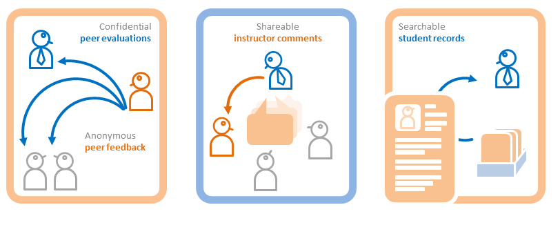
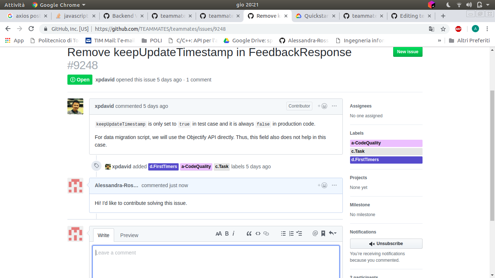
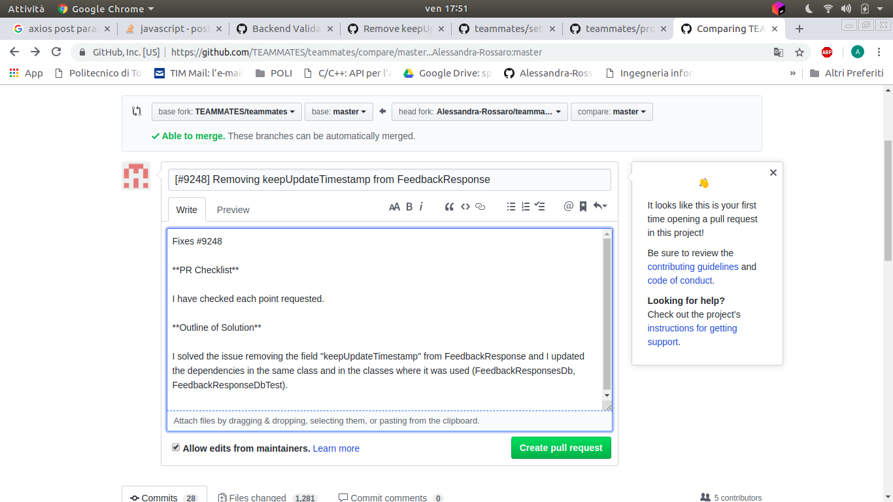
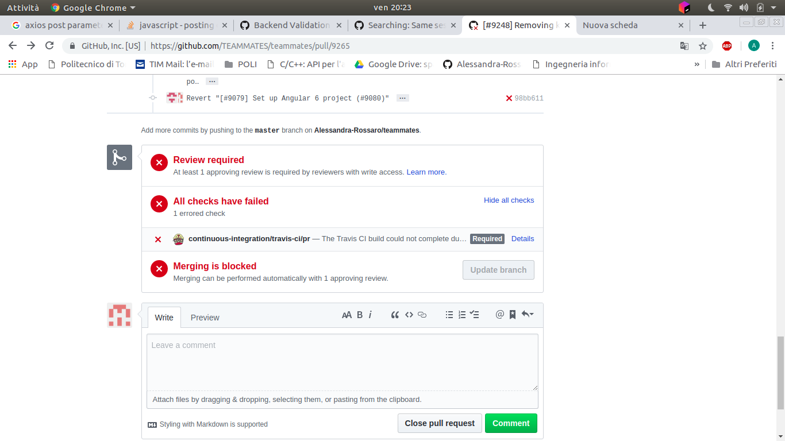
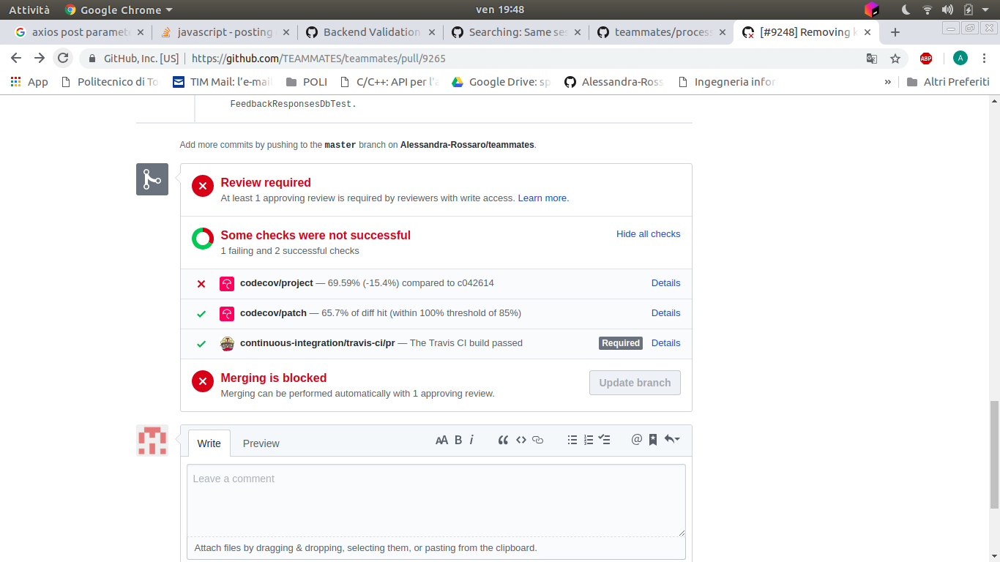
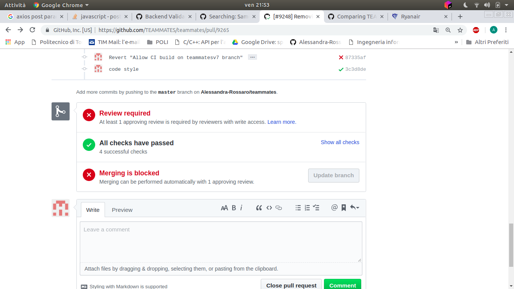
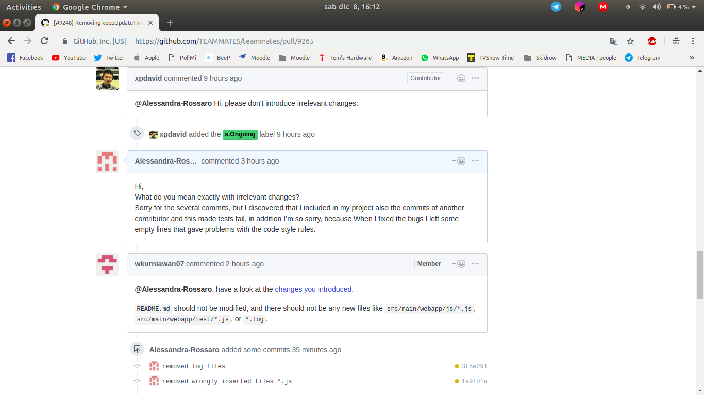
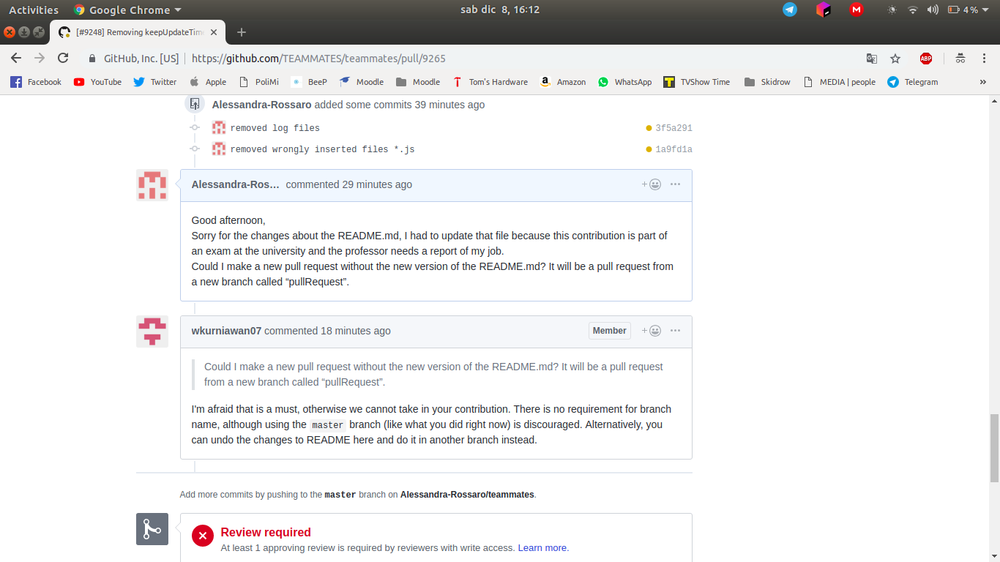
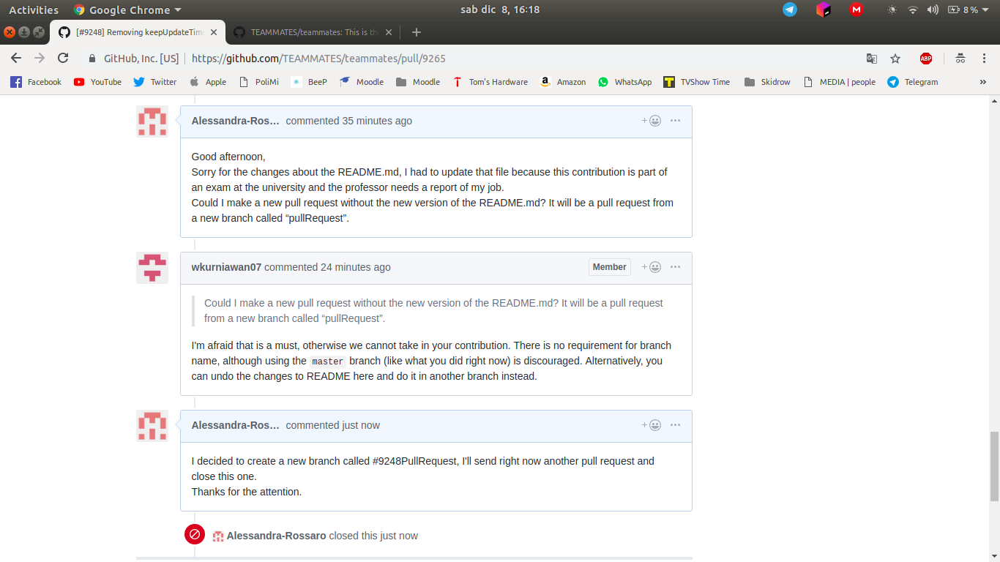
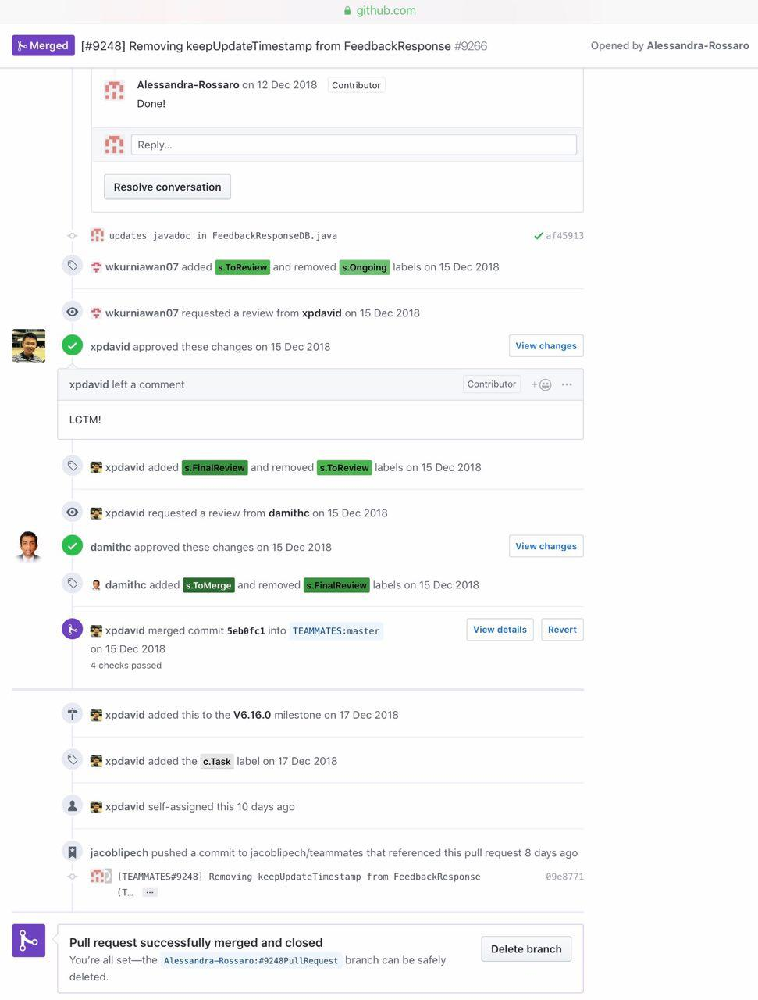

# TEAMMATES Developer Web Site

TEAMMATES is a free online tool for managing peer evaluations and other feedback paths of your students.
It is provided as a cloud-based service for educators/students and is currently used by hundreds of universities across the world.

This is the developer web site for TEAMMATES. **Click [here](http://teammatesv4.appspot.com/) to go to the TEAMMATES product website.**

## Why this project?
I had a lot of dubts about which project to follow, but on the 3rd of December 2018 I found this project really challenging and very closed to my interests: https://github.com/TEAMMATES/teammates/issues/8646.
It consists in updating some methods related on an implementation that could work is to allow extractQuestionDetails (a method) to return the errors since it's already doing the validation, after all, invalid fields should not be permeated in the database.

## 04/12/2018
This morning I talked with the professor about my choice, He said me to update the table on his GitHub repository.

## 05/12/2018
This evening, after dinner, I started to work on the project: the first step was to set up the development environment to work on my laptop!
At the beginning I checked to have all dependencies installed on my laptp: Git, JDK 1.8, Python 2.7, Node.js and Google Cloud SDK. I had to install only the last tool.
I ran some commands to install App Engine Java SDK bundled with the Cloud SDK.
I forked their repo (https://github.com/TEAMMATES/teammates) and cloned the fork to my hard disk.
I ran 'npm install'  to download the necessary tools for JavaScript development and after I ran './gradlew createConfigs' to create the main config files.
I decided to use IntelliJ IDEA as IDE.
To set up the IDE I imported the project as a Gradle project and I configured the project-specific settings.
At this point I followed the Development Guidelines (https://github.com/TEAMMATES/teammates/blob/master/docs/development.md):
I order to use Chrome I needed to use chromedriver extension for testing with this browser. I had to download the latest stable chromedriver extension. 
I specified the path to the chromedriver executable in test.chromedriver.path value in test.properties file.

## 06/12/2018
This afternoon, I started to work, actively, on the project. The first step was to run the server: I had a lot of problems: At the beginning my laptop crashed many times and I asked for a friend of mine to borrow me his laptop, because mine was less powerful. I tried to make the same action with the new device, but, even if it was more powerful than mine, I had the same problems (I wasted a lot of time to make again the steps described before).
I understood that for running the server was enough the 85% of the charging bar.. I expected to need the 100%!
To become a contributor, you needed to start with an open issue labeled as 'starters'. I chosed an issue very interesting: [#9248] Removing keepUpdateTimestamp from FeedbackResponse. It wasn't very difficult, but I had to search in the full project the dependencies and correct or remove them.  
  
After this action, I started to run the tests: it began the really difficult part...
At the beginning, the test suites were not successful because the program skipped a lot of tests and it returned as FAILED. It continued to work in this way all the night. I decided to work on it the day after.

## 07/12/2018
This morning, after my class, I found the strenght to start again! I decided to try again running the server on my laptop, and it successfully worked (so I can gave back the laptop to my friend!), but not the tests.
Anyway, I decided to fill the table on the course's GitHub repository.
I spent all day to run them... because each time there were some problems with the dependencies. After some hours I discovered that the browser in which the tests were run was not set up in the correct way: I wanted to use Google Chrome, but I tried to use Firefox: I fixed this error updating the right browser in the configuration file, but anyway the test suites didn't work in the right way. I started to search on the project GitHub repository: I din't find anything useful for my issue so I tired to skip the test steps and I just focused to fix all the dependencies. After this part I tried to make a Pull request with my work: https://github.com/TEAMMATES/teammates/compare/master...Alessandra-Rossaro:master.  
  
  
The first four times were unsuccessful: due to the incorrect code style (more than one time...), to some missing dependencies and especially due to the presence of commits belonging to another contributor that I wrongly merged into my master branch. I had to revert about ten commits of the other contributor because they caused a failure with the code coverage :  
  
I fixed each issue and I pushed my corrections. At 21:56 I passed all tests!  
    

## 08/12/2018
After midnight I decided to write this travel diary about my first experience with the Open Source world and community. It was not very easy, but I'm sure that it was very challenging and interesting also because I like so much to work in the backend area. Now I'm waiting for the approval of the professor about my contribution on this project and also the approval of the TEAMMATES community about my pull request that fixed the open issue described before. If it will be approved I will consider to continue to give my contribution on other open issues.

This afternoon the community answered to me: they considered my work and labeled it as "Ongoing", they asked for deleting some files that I left in the main project and creating another branch with the original README.md that I changed for writing this report.  
  
  
So I updated the project with the corrections proposed and I advised them about the new branch. I sent a new pull request with the right version of the README.md and I closed the previous pull request.  
  

## 09/12/2018 10/12/2018
I am waiting for a feedback from the community.

## 11/12/2018
The community answered me and asked for removing some tests and irrelevant change as new lines in the oroginal README.md: I made all the corrections requested and so they labeled the project with "s.Ongoing".  
The good thing is taht the community and especially the man who writes me each time answers quite instantaneously, so this is very exciting because you make the modification and someone in the world can see it and I don't know who he is, but we are working together!

## 12/12/2018
The last stuff to fix is about the javadoc above the lines of code that I modified: the community asked for updating it.
I made what they asked for and now I am waiting for the merging! 

## 15/12/2018
TODAY IS THE DAY! The community has approved my contribution to their project. I am so excited... my issue started from "s.Ongoing", then "s.ToReview", "s.FinalReview" and finally "s.ToMerge"! 
My pull request was successfully merged and closed.
  
This experience didn't start in the best possible way... it was hard to prepare the environment to work and the big diffulty, for me,  at the beginning, was also releated to my uncertainty about what I was doing and what I had to do: working on a project of other people that I don't know and this project is something used by other students and professors around the world.. and my small contributin could be an help for the community of developers and in general to all users! It was quite incredible, but I am grateful because the professor assigned me this task. It was something of literally new, that I didn't experience.
It was nice to have this collaboration with the guy of the community taht wrote me abiut my code, for the first time I felt to treat as an adult and not only as a student and I could see my work to start and to finish with the awareness that it wasn't an end in itself as many project done at University!

You can find the complete exchange of emails and the progresses of the projet here: https://github.com/TEAMMATES/teammates/pull/9266 :)

